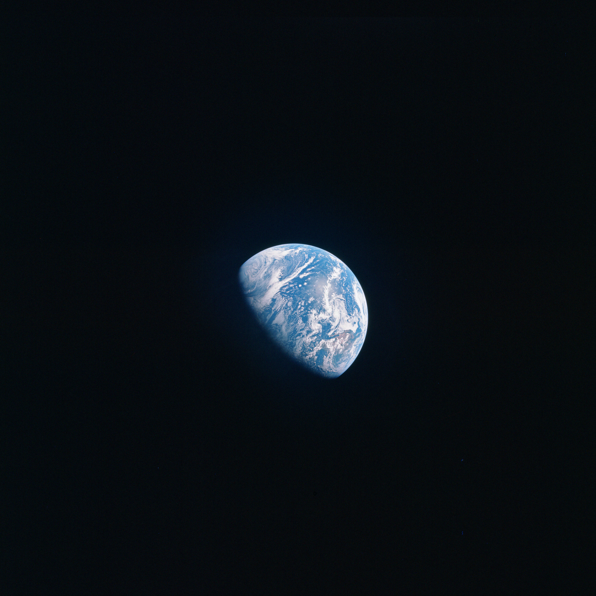

# Notizen

## Ablauf

- Saturn
- Die Paarung
- Neue Umlaufbahn, Enceladus
- Entdeckung der Schwangerschaft
- Planet D (die Erde) ist außergewöhnlich 
- Die 4 bleiben zusammen 
- Flug von Planet G zu Planet G mit [Swing-by-Manöver](https://de.wikipedia.org/wiki/Swing-by)
- Geburt (einer neuen 3)
- Flug zur Erde 
- Ankunft und Umlaufbahn
- Kollision mit Satelliten, Ausfall der Kommunikationssysteme 
- Beobachtung der Ozeane,.Kontinente und Atmosphäre bzw. Wolken
- Pflanzen 
- Zufällige Entdeckung von Walen 
- Tiere auf dem Land
- Entdeckung von Menschen als ein Tier unter anderen Tieren
- Der Mensch ist besonders 
- Städte 
- Technik
- Festival, Fusion

## Das 23. System

- A: Sonne
- B: Merkur
- C: Venus
- D: Erde
- E: Mars
- F: Jupiter
- G: Saturn
- H: Uranus
- I: Neptun

## Links

- [JUICE (Jupiter Raumsonde)](https://de.wikipedia.org/wiki/JUICE_(Raumsonde))
- [Trajektorie (Bahnkurve, Flugbahn)](https://de.wikipedia.org/wiki/Trajektorie_(Physik))

## Kapitel 1


Aufnahme der Saturnringe durch die Raumsonde Cassini im Juli 2013. Im Hintergrund ist rechts unter den Ringen die Erde als leuchtender Punkt zu erkennen.

## Kapitel 4


Mond G.14


Kryovulkanische Aktivität auf Enceladus

Links 

[Kryovulkan](https://de.wikipedia.org/wiki/Kryovulkan)

## Kapitel 5


Apollo 15 Image of Receding Earth

Links

- [The Blue Marble](https://en.wikipedia.org/wiki/The_Blue_Marble)
- [Project Apollo Archive](https://www.flickr.com/photos/projectapolloarchive/)

## Kapitel 6

_Stichworte_

- _Vor Interplanetaren Flügen gibt es besondere Anforderungen_
- _Inspektion der Triebwerk nur mit Raumanzug möglich_
- _Die Eins muss beim Anziehen des Anzugs helfen_
- _Dabei gibt es Körperkontakt, kaum merklich_
- _Nach der Inspektion: Einladung in die Kabine der beiden_
- _Der Andere berührt einen anderen Körper, den Körper der Zwei_
- _Er spürt die Bewegungen des Kindes_
- _(Die Berührungen erregen ihn)_
- _(Die drei kommen eich näher)_

Triebwerke

```
   **    2    **    2
  ****   4   ****   4
 ******  6  ******  6
******** 8 ******** 8
 ******  6  ******  6
  ****   4   ****   4
   **    2    **    2

   **    2    **    2
  ****   4   ****   4
 ******  6  ******  6
******** 8 ******** 8
 ******  6  ******  6
  ****   4   ****   4
   **    2    **    2
```

Links
- [Interplanetarer Raum](https://de.wikipedia.org/wiki/Interplanetarer_Raum)
- [Interstellarer Raum](https://de.wikipedia.org/wiki/Interstellarer_Raum)
- [Intergalaktischer Raum](https://de.wikipedia.org/w/index.php?title=Intergalaktischer_Raum&redirect=no)

- [Vakuum](https://de.wikipedia.org/wiki/Vakuum)


[Hitzeschutzkacheln](https://de.wikipedia.org/wiki/Hitzeschutzkachel) an der Unterseite des Space Shuttles

Buzzard Triebwerk
- [Common buzzard (Mäusebussard)](https://en.wikipedia.org/wiki/Common_buzzard)
- [Rolls-Royce R ](https://de.wikipedia.org/wiki/Rolls-Royce_R)

[Lageregelung](https://www.dlr.de/de/schoollab/standorte/bremen/experimente/lageregelung)

**Wörter**

- [gleichmütig](https://de.wiktionary.org/wiki/gleichm%C3%BCtig)
- [abrupt](https://de.wiktionary.org/wiki/abrupt)

## Kapitel 7

**Links**

- [Weltraum](https://de.wikipedia.org/wiki/Weltraum)
- [Swing-by-Manöver](https://de.wikipedia.org/wiki/Swing-by)


Vier Saturnmonde: Titan (G.6, hinten), Dione (G.4, vor Titan), Prometheus (Mitte, unter den Ringen) und Telesto (oben) mit Saturnringen im Mittelgrund; fotografiert von der Raumsonde Cassini


[Mond G.4 (Dione)](https://de.wikipedia.org/wiki/Dione_(Mond)), Mosaikbild der Raumsonde Cassini, aufgenommen am 11. Oktober 2005 beim bis dahin dichtesten Vorbeiflug der Sonde


[Mond G.6 (Titan)](https://de.wikipedia.org/wiki/Titan_(Mond)),  aufgenommen im sichtbaren Licht aus einer Entfernung von 174.000 km durch die Raumsonde Cassini, 2009


[Jupiter](https://de.wikipedia.org/wiki/Jupiter_(Planet)) in natürlichen Farben, aufgenommen mit dem Hubble-Weltraumteleskop am 5. Januar 2024

**Wörter**

- [Leibesfülle](https://de.wiktionary.org/wiki/Leibesf%C3%BClle)

